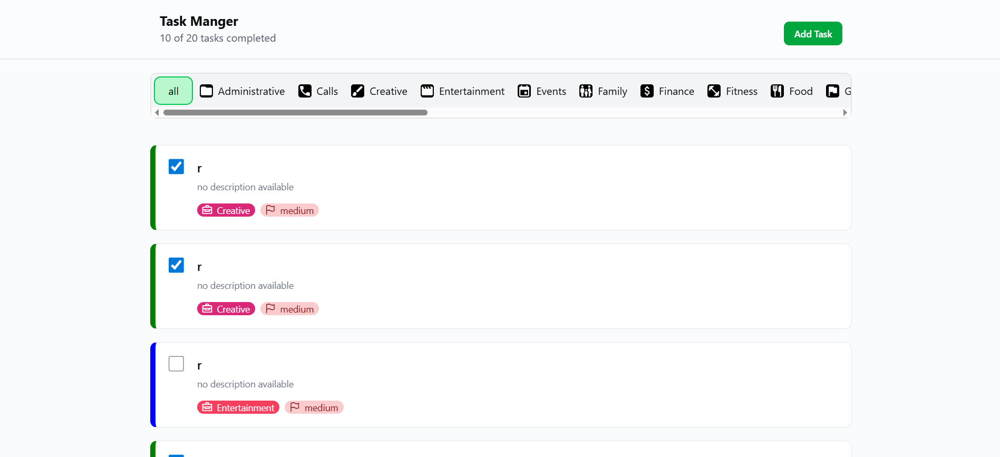
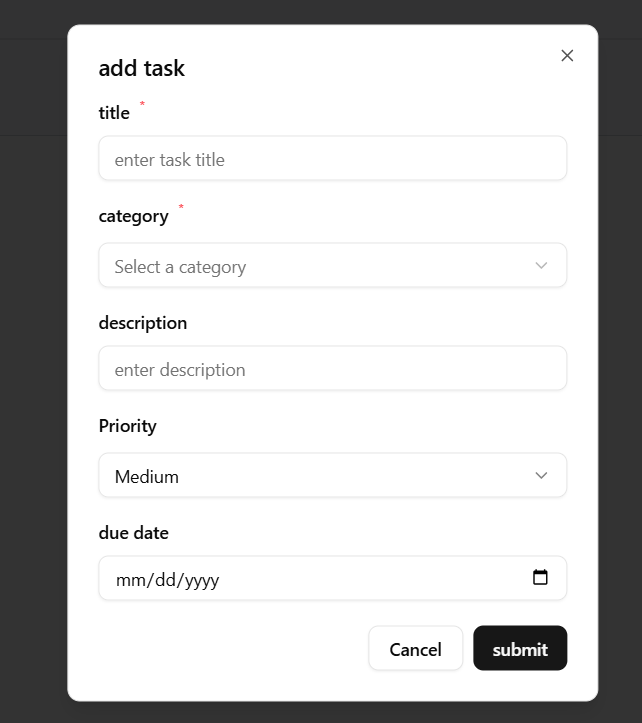
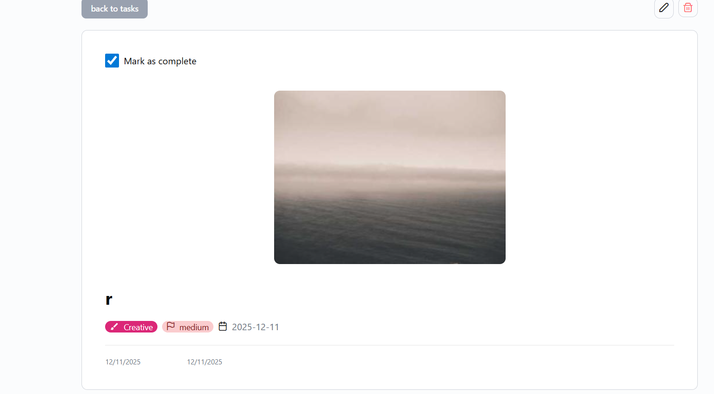
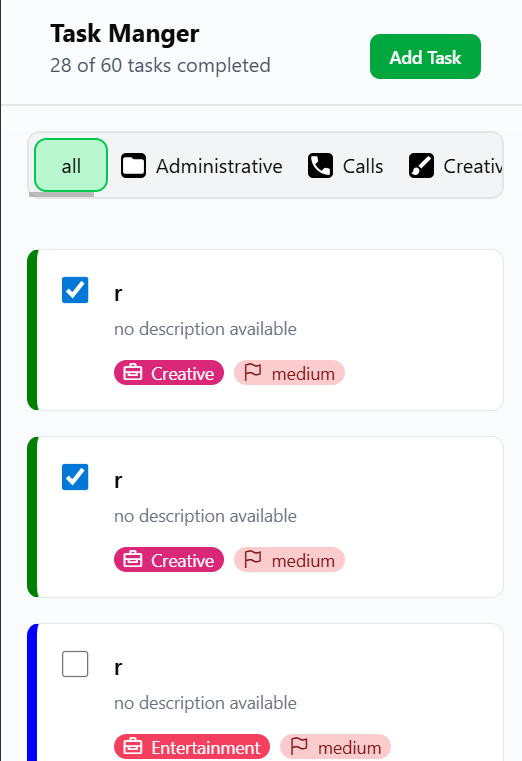

# Task Manager Web Application

A modern task management web application built with Vue.js, featuring task CRUD operations, category filtering, and a responsive design.

**Live Demo**: [https://cool-chimera-28bea7.netlify.app/](https://cool-chimera-28bea7.netlify.app/)

## 🚀 Setup and Run Instructions

### Prerequisites

- Node.js (version ^20.19.0 || >=22.12.0)
- npm or yarn package manager

### Installation

1. Clone the repository:

```bash
git clone <repository-url>
cd task-manager
```

2. Install dependencies:

```bash
npm install
```

### Environment Variables

Create a `.env` file in the root directory with the following variable:

```env
VITE_SUPABASE_KEY=your_supabase_anon_key_here
```

The Supabase URL is already configured in `src/lib/apiClient.ts`. If you need to change it, update the `SUPABASE_URL` constant in that file.

### Development

Run the development server:

```bash
npm run dev
```

The application will be available at `http://localhost:5173` (or the port shown in the terminal).

### Build for Production

```bash
npm run build
```

The built files will be in the `dist` directory.

### Preview Production Build

```bash
npm run preview
```

### Type Checking

```bash
npm run type-check
```

### Linting

```bash
npm run lint
```

### Testing

```bash
npm run test:unit
```

## 🏗️ State Management Approach

This project uses **Pinia** for state management, following Vue 3 Composition API patterns.

### Store Architecture

The application has two main stores:

#### 1. **Task Store** (`src/stores/taskStore.ts`)

Manages all task-related state and operations:

- **State**:
  - `tasks`: Array of task objects
  - `isLoading`: Loading state for async operations
  - `error`: Error messages
  - `offset` & `limit`: Pagination parameters
  - `hasMore`: Boolean indicating if more tasks are available
  - `selectedCategoryId`: Currently selected category filter

- **Actions**:
  - `fetchTasks(rest)`: Fetches tasks with pagination and optional category filtering
  - `fetchMoreTasks()`: Loads additional tasks (infinite scroll)
  - `selectedCategory(categoryId)`: Filters tasks by category
  - `fetchTaskById(id)`: Fetches a single task by ID
  - `addTask(taskData)`: Creates a new task
  - `updateTask(id, taskData)`: Updates an existing task
  - `markTaskComplete(id, completed)`: Toggles task completion status
  - `deleteTask(id)`: Deletes a task

#### 2. **Category Store** (`src/stores/categoryStore.ts`)

Manages category data:

- **State**:
  - `categories`: Array of category objects
  - `isLoading`: Loading state
  - `error`: Error messages

- **Actions**:
  - `fetchCategories()`: Fetches all categories
  - `fetchCategoryById(id)`: Fetches a single category by ID

### Service Layer

The stores interact with a service layer (`src/services/`) that handles all API communication:

- `taskService.ts`: All task CRUD operations
- `categoiresService.ts`: Category fetching operations

This separation ensures clean architecture and makes the codebase more maintainable.

## 📐 Component Architecture Overview

The project follows a feature-based architecture with clear separation of concerns:

```
src/
├── components/          # Reusable UI components
│   └── ui/             # Base UI components (Button, Input, Dialog, etc.)
├── features/           # Feature-specific components
│   ├── categories/     # Category-related components
│   │   └── CategoriesFilter.vue
│   ├── common/         # Shared components
│   │   ├── LoadingSpinner.vue
│   │   ├── SmallLoadingSpinner.vue
│   │   └── TheHeader.vue
│   └── tasks/          # Task-related components
│       ├── AddAndEditTask.vue
│       ├── MarkComplete.vue
│       ├── TaskActions.vue
│       ├── TaskCard.vue
│       ├── TaskDetails.vue
│       └── TasksList.vue
├── layouts/            # Layout components
│   └── MainLayout.vue
├── pages/              # Page components
│   ├── HomePage.vue
│   └── TaskPage.vue
├── router/             # Vue Router configuration
│   └── index.ts
├── services/           # API service layer
│   ├── categoiresService.ts
│   └── taskService.ts
├── stores/             # Pinia stores
│   ├── categoryStore.ts
│   └── taskStore.ts
├── lib/                # Utility functions and API client
│   ├── apiClient.ts
│   └── utils.ts
└── types/              # TypeScript type definitions
    ├── category.ts
    └── task.ts
```

### Key Components

- **HomePage**: Main page displaying the task list with category filtering
- **TaskPage**: Individual task detail page with full task information
- **TasksList**: Displays tasks in a card layout with infinite scroll
- **TaskCard**: Individual task card component
- **TaskDetails**: Full task detail view with actions
- **AddAndEditTask**: Form component for creating and editing tasks
- **CategoriesFilter**: Category filter dropdown component
- **MainLayout**: Main application layout with header

## ✨ Features Implemented

### Core Features

✅ **Task List View**

- Display tasks in card layout with title, description, category, and completion status
- Task images with proper loading and error states
- Category-based filtering via dropdown
- Loading states during data fetching
- Infinite scroll pagination (load more functionality)
- Add Task button/CTA

✅ **Add/Edit Task Form**

- Required fields: Title, Category (dropdown from API)
- Optional fields: Description, Priority, Due Date
- Form validation with error messages
- Save/Cancel functionality
- Loading state during submission
- Reusable component for both add and edit operations

✅ **Task Detail View**

- Display full task information
- Toggle completion status
- Edit and Delete actions with confirmation dialogs
- Image display with fallback handling
- Navigate back to list

✅ **Category Integration**

- Fetch and display categories from API
- Use category colors for visual distinction
- Display category icons where appropriate
- Category filtering functionality

### Technical Implementation

- **Framework**: Vue.js 3 with Composition API
- **State Management**: Pinia
- **Styling**: Tailwind CSS
- **Build Tool**: Vite
- **TypeScript**: Full type safety throughout the application
- **Routing**: Vue Router for navigation
- **API Communication**: Direct HTTP requests (fetch API) to Supabase REST API
- **UI Components**: Custom components built with Reka UI primitives

## ⚠️ Known Limitations

1. **Pagination**: The pagination is implemented client-side using `slice()` method since the Supabase REST API doesn't support range queries directly. This means all tasks are fetched and then sliced, which may not be optimal for large datasets.

2. **Image Loading**: Task images rely on external URLs. If an image URL is invalid or the resource is unavailable, a fallback is shown, but there's no retry mechanism.

3. **Error Handling**: While errors are caught and displayed, there's no automatic retry mechanism for failed API requests. Users need to manually retry actions.

4. **Offline Support**: The application doesn't have offline support or service worker implementation.

5. **Real-time Updates**: Task changes are not reflected in real-time across multiple browser tabs or users. A page refresh is required to see updates from other sources.

## 📸 Screenshots

_Screenshots of key screens should be added here:_






## 🛠️ Tech Stack

- **Vue.js 3.5.25** - Progressive JavaScript framework
- **Pinia 3.0.4** - State management
- **Vue Router 4.6.3** - Client-side routing
- **TypeScript 5.9.0** - Type safety
- **Vite 7.2.4** - Build tool and dev server
- **Tailwind CSS 4.1.17** - Utility-first CSS framework
- **shadcn lib** - UI library
- **primevue** - Icon library

## 📝 Scripts

- `npm run dev` - Start development server
- `npm run build` - Build for production
- `npm run preview` - Preview production build
- `npm run type-check` - Run TypeScript type checking
- `npm run lint` - Run linters (ESLint and Oxlint)
- `npm run test:unit` - Run unit tests

## 🌐 Deployment

The application is deployed on Netlify and available at:
**https://cool-chimera-28bea7.netlify.app/**

## 📄 License

This project is private and created for assessment purposes.
